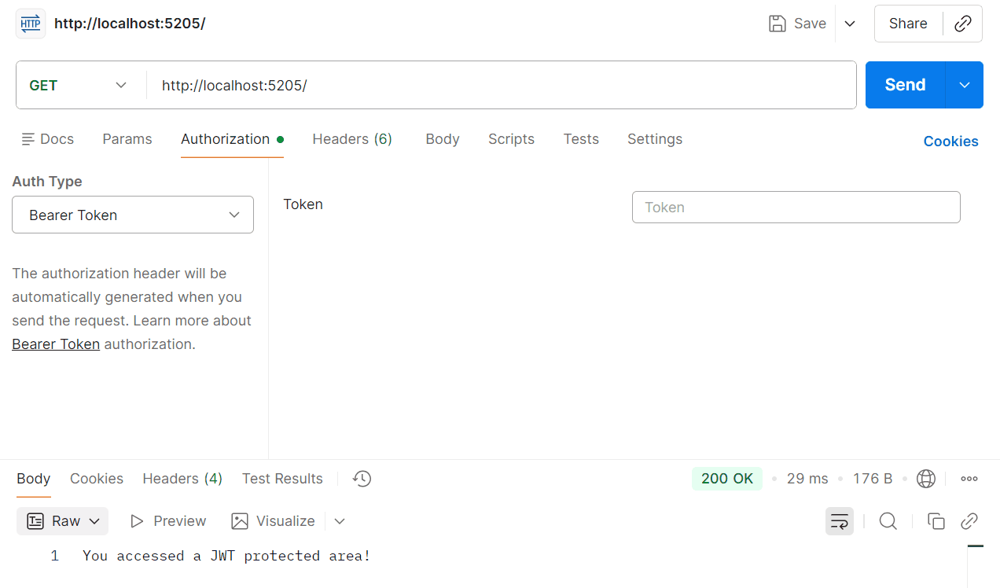

# Authentication and Authorization

## The Authentication Flow

When a request hits your API, it passes through various "checkpoints" (Middleware). <br>

1. Request enters: It carries a token or cookie.

2. Authentication Middleware: It looks for that token. If found and valid, it creates a ClaimsPrincipal (a "User" object) and attaches it to the request.

3. Authorization Middleware: It checks if the "User" object has the right permissions for the specific endpoint.

## Does authentication and authorization always go together?

Yes most of the time.

## Can you have one without the other?

<b>Authentication without Authorization:</b> Possible, but rare. It’s like a "Members Only" club where once you're inside, everyone has access to everything.

<b>Authorization without Authentication:</b> Impossible in a secure system. You cannot determine if someone is "allowed" to do something if you haven't identified who they are first.

## The Middleware "Hand-off"

In your .NET code, they are separate steps in the pipeline.

1. app.UseAuthentication(): This looks at the incoming request (the token or cookie). It populates the User object (technically called ClaimsPrincipal).

2. app.UseAuthorization(): This looks at that User object and checks if it meets the requirements (e.g., [Authorize(Roles = "Admin")]).

## Types of Authentication

<b>
1. API KEY Authentication
</b>
   This involves the client sending a "Secret Key" in the Request Header, and your server validating it. Implemented in ApiKeyMiddleware.cs.
   Tests are written in Authentication.http

<b>Test using POSTMAN</b>

```
1. Set the method to GET.

2. Enter the URL: http://localhost:xxxx/weatherforecast.
(replace xxxx with the port number your server is running on)

3. Go to the Headers tab.

4. In the Key column, type: APIKEYNAME.

5. In the Value column, type: MySecret_123.

6. Click Send.
```

<b>2. Basic Authentication </b>
The UserID and Password aren't sent as separate parameters in the URL; they are combined, encoded, and sent in a specific header called Authorization.

## How it works

```
1. The Header: The client sends:
Authorization: Basic dXNlcjpwYXNz

2. The Decoding: dXNlcjpwYXNz is just Base64. If you decode it, it reveals username:password.

3. The Comparison: You check those against your DB.

4. The Flaw: Because the password is sent with every single request, if someone sniffs the network, they have the user's actual password forever.
```

<b>3. JWT Token </b>
JWT stands for JSON Web Token. Think of it as a Digital Passport.<br>

1. You show your ID (Username/Password) to the server.<br>
2. The server gives you a signed Passport (Token).<br>
3. You show this Passport every time you want to enter a "Protected" area.<br>

<b>The Flow of this Project</b><br>

1. The Login (/login): This is where the token is born. We create "Claims" (info about the user), sign it with a Secret Key, and send the string back to the user.
2. The Rules (AddJwtBearer): We tell the app exactly what a "Valid" passport looks like (Must have the right Issuer, Audience, and the correct Secret Signature).

3. The Bouncer (UseAuthentication): This middleware intercepts every request. It looks for a token. If it finds one, it verifies it using the "Rules" we defined.

4. The Gate (RequireAuthorization): This lock is placed on specific endpoints. If the Bouncer hasn't verified you, this lock won't open.

<b>Why use .RequireAuthorization() instead of [Authorize]?</b><br>
.RequireAuthorization(): Used for Minimal APIs (the app.MapGet style).<br>
[Authorize] attribute: Used in Controller-based APIs (where you have separate classes for Controllers).<br>

Both do the exact same thing: They trigger the Authorization middleware to check if the user is identified.<br>

## How to test this experiment

1. Get the Token: Call GET /login.
   Copy the long string result.

2. Access Protected: Call GET /protected.
   It will fail with 401 Unauthorized at first.

3. Use the Passport: Call GET /protected again, but add a Header:
   Key: Authorization
   Value: Bearer <your_token_here>

   
